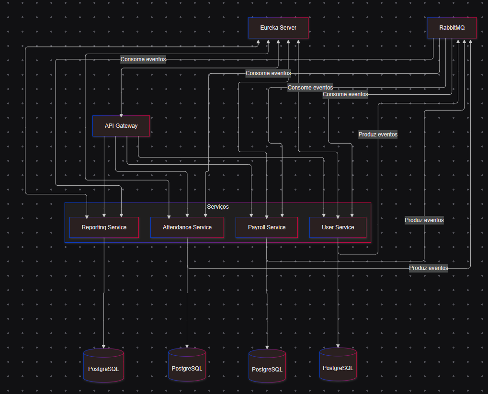

# Sistema de Folha de Ponto

Este é um sistema de Folha de Ponto desenvolvido com uma arquitetura baseada em microserviços, utilizando **Spring Boot**, **RabbitMQ** para comunicação assíncrona, **Eureka Server** para registro e descoberta de serviços, e um **API Gateway** para gerenciamento de tráfego.

---

## **Arquitetura do Sistema**

A aplicação é composta pelos seguintes microserviços:

1. **UserService**:
   - Gerencia os dados dos usuários (funcionários).
   - Produz eventos relacionados a usuários.

2. **AttendanceService**:
   - Processa e armazena registros de ponto.
   - Produz eventos relacionados à marcação de ponto.

3. **PayrollService**:
   - Processa a folha de pagamento com base nos registros de ponto.
   - Produz eventos relacionados à folha de pagamento.

4. **ReportingService**:
   - Gera relatórios com base nos dados consolidados de outros serviços.
   - Consome eventos de outros serviços.

5. **Eureka Server**:
   - Fornece um registro centralizado para todos os microserviços, permitindo que se comuniquem dinamicamente.

6. **API Gateway**:
   - Garante o acesso centralizado aos serviços, simplificando a comunicação entre clientes e microserviços.

7. **RabbitMQ**:
   - Atua como broker para comunicação assíncrona entre microserviços.

---

## Documentação da API

Cada microserviço possui sua própria documentação Swagger UI acessível através dos seguintes endpoints:

- API Gateway: http://localhost:8080/swagger-ui.html
- User Service: http://localhost:8084/swagger-ui.html
- Attendance Service: http://localhost:8086/swagger-ui.html
- Payroll Service: http://localhost:8087/swagger-ui.html
- Reporting Service: http://localhost:8085/swagger-ui.html
- Eureka Server: http://localhost:8761
---

## **Diagrama do Fluxo de Comunicação**

Diagrama de Fluxo Mermaid



---

## **Tecnologias Utilizadas**

- **Linguagem:** Java 17
- **Frameworks:**
  - Spring Boot
  - Spring Cloud Netflix (Eureka)
  - Spring Cloud Gateway
  - Spring AMQP (RabbitMQ)
- **Mensageria:** RabbitMQ
- **Gerenciamento de Dependências:** Maven
- **Containers:** Docker
- **Banco de Dados:** PostgreSQL
- **Documentação:** Mermaid e Swagger

---

## **Pré-requisitos**

Antes de rodar o projeto, certifique-se de ter instalado:

1. **Docker** e **Docker Compose**.
2. **Java 17+**.
3. **Maven**.
4. **RabbitMQ** (caso não esteja usando via Docker).

---

## **Como Executar**

1. Clone o repositório:
   ```bash
   git clone https://github.com/Glauber-Developer/dot-sheet.git
   cd dot-sheet
2. Build Images para Windows:
    
   ```bash
   .\build-images.ps1

3. Build Images para Mac e Linux:
   ```bash
    bash ./build-images.sh
4. Suba os serviços com Docker Compose:
   ```bash
   docker-compose up

5. Acesse o Eureka Server para visualizar os microserviços registrados:
   ```bash
   http://localhost:8761

6. Acesse o API Gateway para interagir com os serviços:
   ```bash
   http://localhost:8080
7. Acesse o RabbitMQ para visualizar os eventos:
   ```bash
   http://localhost:15672
## *Licença*

*Este projeto está licenciado sob a MIT License.* 